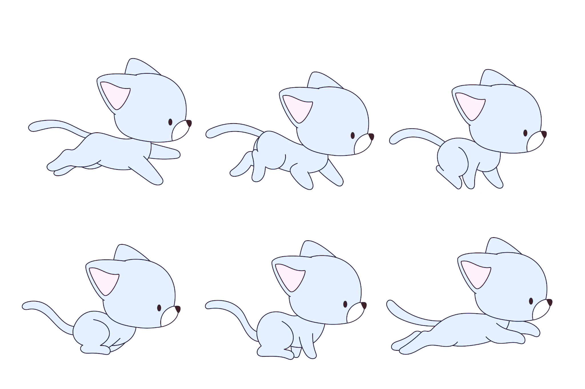
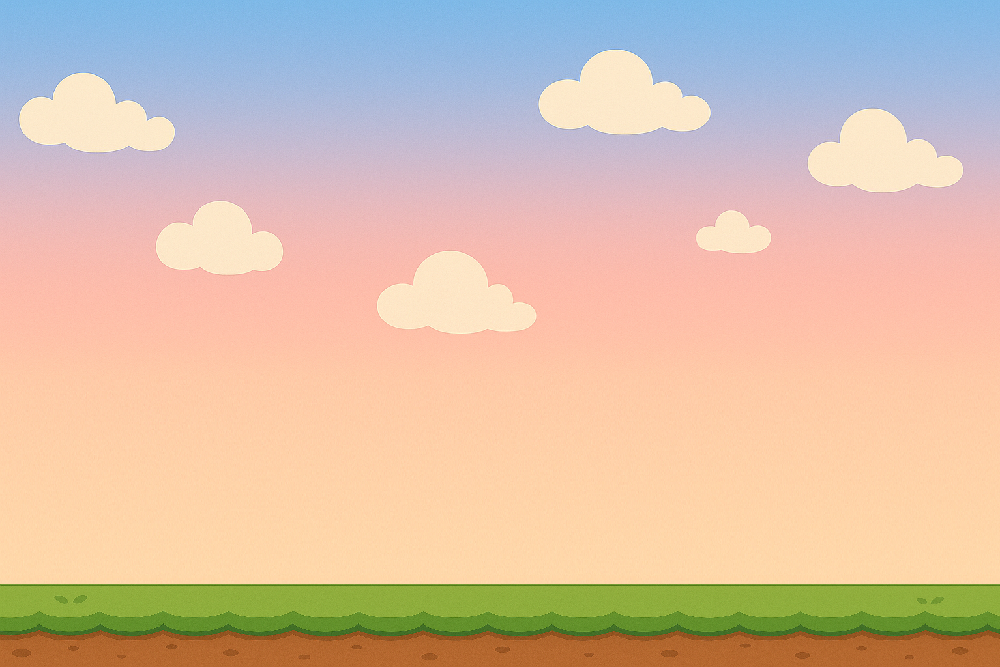
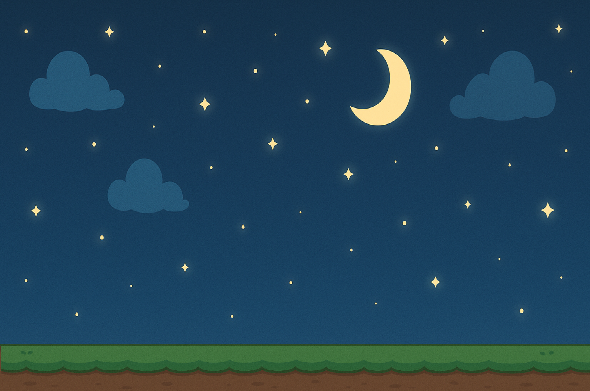
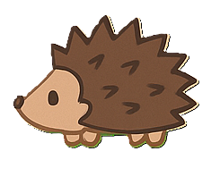

# Game: Don't Trip Meow!

+Họ và Tên: Đặng Nhật Quang
+MSSV: 24021606

* Chủ đề game: 
+ Một game chạy không ngừng đơn giản được xây dựng bằng C++ sử dụng thư viện SDL2. 
+ Người chơi điều khiển nhân vật nhảy qua các chướng ngại vật để ghi điểm cao nhất có thể. 
+ Game có hỗ trợ hiệu ứng ngày đêm, âm nhạc nền, và hệ thống menu thân thiện.

* Ngưỡng điểm mong muốn: 8.7 / 10
Lý do bảo vệ ngưỡng điểm:

1. Hoàn thiện đầy đủ chức năng cơ bản của một game SDL2
Hiển thị đồ họa (nhân vật, nền, chướng ngại vật, UI).
Điều khiển nhân vật bằng bàn phím (nhảy bằng phím SPACE).
Cài đặt vòng lặp game đúng chuẩn: cập nhật logic, vẽ khung hình, xử lý sự kiện.
Tự xử lý va chạm giữa nhân vật và chướng ngại vật.

2. Tính năng mở rộng (tự học - tự làm):
Hiệu ứng ngày - đêm: Tự động chuyển đổi giữa hai background theo thời gian chơi → tăng chiều sâu hình ảnh.
Hệ thống âm thanh:
Phát nhạc nền bằng SDL_mixer.
Cho phép bật/tắt nhạc, điều chỉnh âm lượng bằng phím + và -.
Chướng ngại vật di chuyển liên tục:
Tự viết class quản lý chướng ngại vật.
Tăng tốc độ di chuyển dần theo thời gian → tạo cảm giác game khó dần.

3. UI và trải nghiệm người dùng (tự làm UI từ đầu):
Menu chính với nút bắt đầu, thoát.
Menu âm nhạc: tăng/giảm âm lượng, bật/tắt nhạc.
Màn hình Game Over hiển thị điểm và cho phép chơi lại.
Sử dụng Button class để quản lý các nút, xử lý tương tác bằng chuột.

4. Tính bền vững và mở rộng của mã nguồn:
Chia rõ các class: Player, Obstacle, Music, Button.
Quản lý tài nguyên tốt: load ảnh, font, nhạc một lần và giải phóng đúng cách.
Ghi và đọc điểm cao từ file highscore.txt - sử dụng file I/O.

5. Thuật toán/kiến thức sử dụng:
Quản lý thời gian chuyển cảnh (ngày - đêm) bằng hệ thống timer.
Cài đặt cơ chế va chạm hình chữ nhật (AABB collision).
Xử lý tốc độ khung hình, đảm bảo game mượt.
Quản lý sprite sheet cho nhân vật chuyển động → hiểu kỹ về SDL_Rect và SDL_RenderCopy.

* Mức độ sử dụng AI
Sử dụng ChatGPT để:
    Hiểu cách tổ chức code trong game (file main.py, tách UI, âm thanh, gameplay).
    Học cú pháp Pygame nâng cao như pygame.Rect, xử lý animation.
    Sửa lỗi khi game bị crash.
* Hình ảnh: 
 lấy ở trên mạng https://www.freepik.com/vectors/animation-sequence
 nhờ chat gpt vễ hộ
 nhờ chat gpt vễ hộ
 nhờ chat gpt vẽ hộ
 nhờ chat gpt vẽ hộ

* Âm Thanh:
https://www.youtube.com/watch?v=ZVRbS1m_Xm4 lấy từ youtube
